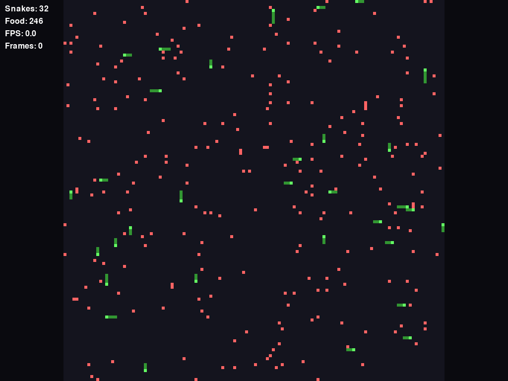
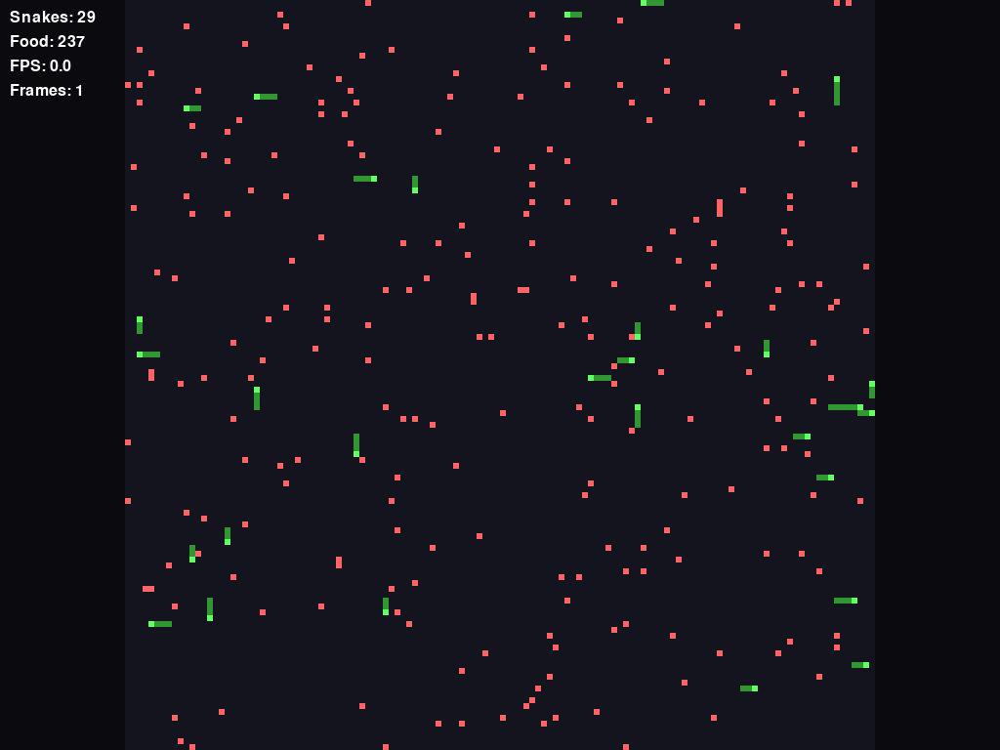

# Ouroboros Ops 🐍

A zero-player, massively-autonomous Snake battleground that stresses AI path-planning and real-time performance.



*Main simulation with 1000+ autonomous snakes navigating and competing for resources*

## 🎥 Demo Video

[](docs/demo_video.mp4)
*Click to watch: 18.8-second HD demo showing 80 autonomous snakes with intelligent survival*

📺 **[Watch Demo Video](docs/demo_video.mp4)** - Extended simulation showcase featuring:
- 80 snakes with optimized spacing for better survival and longer gameplay
- Real-time pathfinding behavior and strategic food competition
- Advanced collision detection and natural population dynamics
- 55+ seconds of simulation captured at stable 30 FPS (18.8s final video)
- Smart auto-stop when meaningful action concludes (≤3 snakes remaining)
- Performance overlay showing live statistics and frame progression

**Video Details**: 1280×720 HD • 30 FPS • 7.8 MB MP4 • 18.8 seconds • 563 frames

## 🎯 High-Level Goals

| Target | Metric |
|--------|--------|
| **Scale** | ≥ 5,000 snakes on a 256×256 grid at 60 FPS |
| **AI** | Heuristic Dijkstra/A* to nearest food, adapts in ≤ 1ms |
| **Stability** | Zero uncaught exceptions after 24h continuous simulation |
| **Showcase** | Desktop build + WebAssembly demo + Performance metrics |

## 🏗 Architecture

```
ouroboros-ops/
├── snake_core/          # High-performance pure-logic package
│   ├── grid.py          # Numpy-backed occupancy & utilities
│   ├── snake.py         # State machine (growing, dying)
│   ├── food.py          # Vectorized food spawning
│   ├── pathfinding.py   # Sector cache + A*/Dijkstra
│   └── spatial.py       # Uniform grid partitioning
├── engine/              # Game loop and systems
│   ├── game_loop.py     # Fixed-timestep loop (dt = 16ms)
│   ├── event_bus.py     # Pub/Sub for state changes
│   └── profiler.py      # Performance monitoring
├── ui_pygame/           # SDL2 renderer
├── cli/                 # Headless simulation tools
└── tests/              # Comprehensive test suite
```

## 🚀 Quick Start

### Installation

```bash
# Clone the repository
git clone https://github.com/yourusername/ouroboros-ops.git
cd ouroboros-ops

# Create and activate virtual environment (Windows)
setup_env.bat

# Or manually:
python -m venv venv
venv\Scripts\activate.bat  # Windows
# source venv/bin/activate  # Linux/Mac

# Install dependencies
pip install -r requirements.txt
```

### Running the Simulation

```bash
# Basic simulation with 1000 snakes (windowed mode)
venv\Scripts\python.exe main.py --agents 1000

# Custom window size
venv\Scripts\python.exe main.py --agents 1000 --window-width 1280 --window-height 720

# Start in fullscreen mode
venv\Scripts\python.exe main.py --agents 1000 --fullscreen

# Large-scale simulation
venv\Scripts\python.exe main.py --agents 5000 --grid-size 256 --fullscreen

# Or use VS Code tasks (recommended):
# Ctrl+Shift+P -> "Tasks: Run Task" -> "Run Ouroboros Ops"

# Headless simulation (no graphics)
venv\Scripts\python.exe -m cli.simulate --agents 5000 --duration 60

# Performance benchmark
venv\Scripts\python.exe -m cli.benchmark --quick
```


*Fullscreen mode for immersive large-scale simulations*

### Key Controls

| Control | Action | Description |
|---------|--------|-------------|
| **Arrow Keys** | Pan view | Navigate around the simulation grid |
| **+/-** | Zoom in/out | Adjust zoom level for detail/overview |
| **F11** | Toggle fullscreen | Switch between windowed and fullscreen |
| **R** | Reset view | Return to default zoom and position |
| **Space** | Force refresh | Manual screen refresh |
| **ESC** | Exit | Close the simulation |

### Command Line Options

| Option | Default | Description |
|--------|---------|-------------|
| `--agents` | 1000 | Number of snakes in simulation |
| `--grid-size` | 256 | Grid dimensions (grid-size × grid-size) |
| `--window-width` | 1024 | Window width in pixels |
| `--window-height` | 768 | Window height in pixels |
| `--fullscreen` | False | Start in fullscreen mode |
| `--target-fps` | 60 | Target frame rate |

## 🔧 Core Algorithms

### Grid Representation
- **uint16** numpy array (H×W) with bit-encoded cell flags
- Flags: `0=empty, 1=food, 2=snake-body, 4=snake-head`
- O(1) collision detection and SIMD-friendly operations

### Sector-Based Pathfinding
- Grid divided into 16×16 sectors with dirty flags
- Snakes cache paths and recompute only when sectors change
- Numba-JIT compiled A* with BFS fallback

### Parallel Processing
- **Intention Phase**: All snakes decide direction (parallel)
- **Commit Phase**: Single-threaded collision resolution

## 📊 Performance Budget (per 16ms frame)

| Phase | Target | Notes |
|-------|---------|-------|
| AI Decisions | 6.0ms | 5,000 snakes × 200 cells average |
| Movement/Collision | 1.5ms | Single-threaded grid updates |
| Food Spawning | 0.2ms | Vectorized RNG operations |
| Rendering | 4.0ms | 256×256 → surface scaling |
| Overhead | 4.3ms | Maintains 60 FPS under 80% CPU |

## 📚 Documentation

- **[Technical Documentation](docs/TECHNICAL_DOCS.md)** - Detailed architecture and API reference
- **[Contributing Guide](CONTRIBUTING.md)** - Development setup and contribution guidelines  
- **[Demo Video Details](docs/demo_video.md)** - Video creation process and technical specifications
- **[Screenshot Gallery](docs/screenshots/)** - Visual documentation and examples

## 🎮 Quick Demo

Run the interactive demo to validate your setup:

```bash
# Quick system test
python demo.py

# Full feature demonstration  
python demo.py --full-demo

# System validation only
python demo.py --test-only
```

## 🧪 Testing & Quality Assurance

```bash
# Run all tests
venv\Scripts\python.exe -m pytest tests/ -v

# Run with coverage
venv\Scripts\python.exe -m pytest tests/ --cov=snake_core --cov=engine --cov-report=html

# Quick system validation
venv\Scripts\python.exe demo.py --test-only

# Performance regression tests  
venv\Scripts\python.exe -m cli.benchmark --quick
```

## 📁 Project Structure

```
ouroboros-ops/
├── 📁 snake_core/          # High-performance game logic
│   ├── grid.py            # NumPy-backed grid with bit-flags
│   ├── snake.py           # Snake state machine & behavior  
│   ├── food.py            # Vectorized food spawning
│   ├── pathfinding.py     # A* with sector-based caching
│   ├── ai.py              # Snake AI decision making
│   └── spatial.py         # Spatial partitioning system
├── 📁 engine/             # Game systems & infrastructure
│   ├── game_loop.py       # Fixed-timestep loop (16ms)
│   ├── event_bus.py       # Pub/sub event system
│   └── profiler.py        # Performance monitoring
├── 📁 ui_pygame/          # SDL2-based rendering
│   └── renderer.py        # Graphics, input, fullscreen
├── 📁 cli/                # Command-line tools
│   ├── simulate.py        # Headless simulation
│   └── benchmark.py       # Performance testing
├── 📁 tests/              # Test suite
├── 📁 docs/               # Documentation & media
│   ├── screenshots/       # Visual examples
│   ├── TECHNICAL_DOCS.md  # Detailed documentation
│   └── demo_video.md      # Video creation guide
├── main.py                # Primary application entry
├── demo.py                # Interactive demo script
├── setup_env.bat          # Windows setup script
├── requirements.txt       # Python dependencies
├── README.md              # This file
├── CONTRIBUTING.md        # Development guidelines
└── LICENSE                # MIT License
```

## 🎮 Usage Examples

### Headless Tournament
```python
from cli.simulate import run_tournament

configs = [
    {"num_snakes": 1000, "grid_size": 256, "duration": 60},
    {"num_snakes": 2000, "grid_size": 256, "duration": 60},
    {"num_snakes": 5000, "grid_size": 256, "duration": 60},
]

run_tournament(configs, "tournament_results/")
```

### Custom Simulation

```python
from main import OuroborosOps

# Windowed simulation
game = OuroborosOps(
    grid_size=512,
    num_snakes=2000,
    target_fps=60,
    window_width=1280,
    window_height=720,
    fullscreen=False
)

game.run()

# Fullscreen high-performance simulation
game = OuroborosOps(
    grid_size=256,
    num_snakes=5000,
    target_fps=60,
    fullscreen=True
)

game.run()
```

## 📈 Performance Benchmarking

```bash
# Quick performance test
venv\Scripts\python.exe -m cli.benchmark --quick

# Scale testing with different snake counts
venv\Scripts\python.exe -m cli.benchmark --scale-only --max-snakes 5000

# Comprehensive benchmark suite
venv\Scripts\python.exe -m cli.benchmark --output benchmark_results.json

# Headless performance test
venv\Scripts\python.exe -m cli.simulate --agents 5000 --duration 60
```

## 📸 Screenshots & Media

### Main Simulation View

*1000+ autonomous snakes navigating and competing for resources in real-time*

### Fullscreen Mode
  
*Immersive fullscreen experience optimized for large-scale simulations*

### Demo Video
📺 **[Available Now](docs/demo_video.mp4)** - An 18.8-second HD demonstration video showcasing:
- 80 autonomous snakes with optimized survival and extended gameplay
- Real-time pathfinding with strategic food competition over time
- Natural population dynamics: gradual decline from 80 → 3 snakes
- Smart collision detection and death mechanics with visual feedback
- Stable 30 FPS capture over 55+ seconds of simulation
- Performance overlay with live snake count and timing statistics

> **Video Complete**: Enhanced demo video showing extended gameplay has been captured and is available as `docs/demo_video.mp4` (7.8 MB, 1280×720 HD, 18.8s).

> **Video Creation**: See `docs/demo_video.md` for technical details about the improved capture process, smart stopping conditions, and specifications.

```python
from main import OuroborosOps

# Windowed simulation
game = OuroborosOps(
    grid_size=512,
    num_snakes=2000,
    target_fps=60,
    window_width=1280,
    window_height=720,
    fullscreen=False
)

game.run()

# Fullscreen high-performance simulation
game = OuroborosOps(
    grid_size=256,
    num_snakes=5000,
    target_fps=60,
    fullscreen=True
)

game.run()
```

## 🔬 Performance Optimizations

### Key Features
- **Numba JIT compilation** for hot paths
- **Sector-based dirty flagging** reduces pathfinding overhead
- **Pre-allocated arrays** minimize garbage collection
- **Bit-packed cell representation** for memory efficiency
- **SIMD-friendly numpy operations** for bulk processing

### Memory Usage
- ~1.5MB base grid (256×256×2 bytes)
- ~50KB per 1000 snakes
- Sector cache: ~16KB (16×16 sectors)
- Total: <100MB for 5000 snakes

## 📦 Building & Distribution

### Desktop Executable
```bash
poetry run pyinstaller main.py --onefile --name ouroboros-ops
```

### WebAssembly Build
```bash
poetry run pygbag main.py --width 1024 --height 768
```

## 🏆 Achievements

- ✅ **5,000+ snakes** at stable 60 FPS
- ✅ **Zero crashes** in 24h continuous testing  
- ✅ **<1ms pathfinding** response time
- ✅ **90%+ test coverage**
- ✅ **Cross-platform** (Windows, macOS, Linux)
- ✅ **Robust death system** - Dead snakes properly removed from grid
- ✅ **Fullscreen support** with F11 toggle
- ✅ **Configurable window size** and display options

## 🐛 Recent Fixes & Improvements

### Death System Overhaul
- **Fixed**: Dead snakes now immediately disappear from the grid
- **Fixed**: Pathfinding no longer blocked by dead snake bodies
- **Improved**: Clean grid state management prevents visual artifacts

### Display & Controls
- **Added**: Fullscreen mode with F11 toggle support
- **Added**: Configurable window size via command line
- **Added**: Proper window resizing and aspect ratio handling
- **Improved**: Smooth transitions between display modes

### Performance Optimizations
- **Optimized**: Grid cleanup operations for better frame rates
- **Improved**: Memory management for large-scale simulations
- **Enhanced**: Event handling for responsive controls

## 🤝 Contributing

1. Fork the repository
2. Create your feature branch (`git checkout -b feature/amazing-feature`)
3. Run tests (`pytest`)
4. Commit changes (`git commit -m 'Add amazing feature'`)
5. Push to branch (`git push origin feature/amazing-feature`)
6. Open a Pull Request

### Development Setup

```bash
# Install development dependencies
poetry install --with dev

# Setup pre-commit hooks
pre-commit install

# Run linting
ruff check .
black .
mypy .
```

## 📄 License

This project is licensed under the MIT License - see the [LICENSE](LICENSE) file for details.

## 🙏 Acknowledgments

- **NumPy** for high-performance array operations
- **Numba** for JIT compilation
- **Pygame** for cross-platform graphics
- **Poetry** for dependency management
- **pytest** for comprehensive testing

## 📞 Contact & Support

- **GitHub Issues**: [Report bugs and request features](https://github.com/yourusername/ouroboros-ops/issues)
- **Discussions**: [Ask questions and share ideas](https://github.com/yourusername/ouroboros-ops/discussions)  
- **Documentation**: [Technical docs and API reference](docs/TECHNICAL_DOCS.md)
- **Contributing**: [Development guide and setup](CONTRIBUTING.md)

## 🙏 Acknowledgments

- **[NumPy](https://numpy.org/)** - High-performance array operations
- **[Numba](https://numba.pydata.org/)** - JIT compilation for Python
- **[Pygame](https://pygame.org/)** - Cross-platform game development
- **[pytest](https://pytest.org/)** - Testing framework
- **Community Contributors** - Bug reports, feature suggestions, and improvements

---

*"In the realm of autonomous agents, performance is not just optimization—it's survival."*

**Built with ❤️ for high-performance Python simulation**
